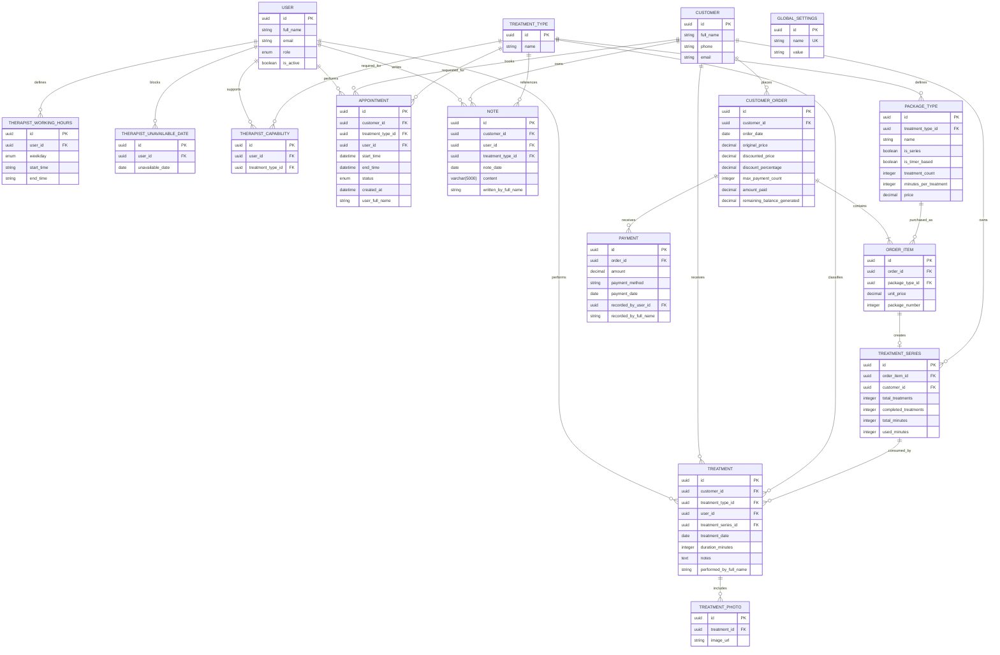

# Database Schema

Database: PostgreSQL. ORM: Entity Framework Core 10. All IDs are UUIDs.

## ER Diagram

## Design Notes

- `User.role` is `Manager` or `Therapist`. No separate Therapist table.
- `TreatmentSeries` is created only for `PackageType.is_series = true` packages.
- `TreatmentSeries.customer_id` is denormalized (copied from `CustomerOrder.customer_id` via
  `OrderItem` at series-creation time) to support fast active-series lookups per customer
  without a join through `OrderItem`/`CustomerOrder`. `Restrict` on delete.
- `completed_treatments` for timer-based series is derived: `floor(used_minutes / minutes_per_treatment)`. Updated after each timer session.
- `GLOBAL_SETTINGS` is a key-value table. Each setting is a separate row with a unique `name` and a string `value`. Currently defined: `default_max_payment_count`.
- `PACKAGE_TYPE.price` — catalog price (`decimal(10,2)`). Snapshot copied to `ORDER_ITEM.unit_price` at order creation. Price changes do not affect historical orders.
- `ORDER_ITEM.package_number` — stable per-customer package number (int, not null), assigned once at order-creation time in purchase order (1, 2, 3, ...) and never reassigned; gaps are expected when a package completes or its order is deleted. Assignment locks the owning `Customer` row (`SELECT ... FOR UPDATE`) before computing `MAX(package_number) + 1` across all of the customer's order items, preventing races under concurrent order creation. No unique constraint is needed — the row lock alone makes numbering race-free. `TreatmentSeries` does not duplicate this value; it is read through `TreatmentSeries.OrderItem.PackageNumber`.
- `CUSTOMER_ORDER.remaining_balance` — PostgreSQL `GENERATED ALWAYS AS (discounted_price - amount_paid) STORED`. Never written from application code.
- `PAYMENT.recorded_by_user_id` / `recorded_by_full_name` — server-derived from the authenticated JWT at payment creation. Client never supplies these values.
- Money columns: `decimal(10,2)` throughout.
- `APPOINTMENT.status` — `Scheduled` | `Completed` | `Cancelled` | `NoShow` at the enum level, but
  Phase 011's API only exercises `Scheduled` → `Cancelled` (via DELETE). `Completed` / `NoShow`
  and any Appointment → Treatment link are deferred to a future phase.
- `APPOINTMENT.user_full_name` — snapshotted at creation/reschedule time, same pattern as
  `TREATMENT.performed_by_full_name` / `NOTE.written_by_full_name` / `PAYMENT.recorded_by_full_name`.
- `APPOINTMENT.start_time` / `end_time` — naive local time (Israel), no DST-aware conversion, same
  convention as `TREATMENT.treatment_date` / `PAYMENT.payment_date` / `NOTE.note_date` (CR-019's
  `DateTimeOffset` migration stays deferred). Column type is `timestamp without time zone`; always
  written with `DateTimeKind.Unspecified` explicitly at the application layer.
- `APPOINTMENT.created_at` — a genuine UTC instant (`timestamp with time zone`), set via
  `DateTime.UtcNow` at the application layer. Unlike `start_time`/`end_time`, it is not part of the
  naive-local convention above.
- Double-booking prevention (ADR-011-A) locks the target therapist's `USER` row
  (`SELECT ... FOR UPDATE`) as a mutex before the overlap check + `APPOINTMENT` insert/update —
  not the `APPOINTMENT` rows themselves, since the conflicting row may not exist yet at lock time
  (a naive row lock on existing rows would not block a concurrent phantom insert under READ
  COMMITTED). A reschedule that changes therapist locks both the old and new `USER` rows in
  ascending-GUID order to avoid deadlock. Any future code path that inserts/moves an `APPOINTMENT`
  must take this same lock first. Phase 012 note on scope: schedule edits (working hours /
  capabilities / unavailable dates) intentionally do not take this same `USER`-row lock and do not
  retroactively validate existing appointments; narrowing a therapist's availability can leave
  already-booked appointments outside the new constraints — same accepted-risk class as the
  deactivation-orphaned-appointments risk below.
- `USER.is_active` (Phase 012) — boolean, not null, default `true`. `false` means the therapist has
  left the clinic: excluded from `GET /api/v1/therapists`, from the default
  `GET /api/v1/therapists/availability` response, and login is rejected (`AuthController.Login`,
  same 401 shape as an unknown/wrong-password login). Existing `Appointment`/`Treatment`/`Note`
  rows referencing an inactive user remain fully valid and queryable — deactivation is not a
  cascading operation and does not retroactively touch history. No index — `Users` is too small a
  table to benefit (confirmed by architecture review).
- `THERAPIST_WORKING_HOURS` / `THERAPIST_UNAVAILABLE_DATE` / `THERAPIST_CAPABILITY` (Phase 012) —
  full CRUD via `/api/v1/therapists/{userId}/working-hours|capabilities|unavailable-dates`
  (Manager-only writes, both-roles reads), superseding Phase 011's seed-only/read-only status. All
  three still require the target `userId` to resolve to an existing, active `Therapist`-role
  `User` for any write.
- `THERAPIST_WORKING_HOURS.weekday` is stored as text (enum-as-string, e.g. `"Sunday"`), not an
  integer column — declaration order is `Sunday=0 .. Saturday=6`, matching both .NET's
  `DateTime.DayOfWeek` and the frontend's `Date.getDay()`. Caution: casting the enum to `int`
  inside an EF Core LINQ `Select()` projection translates to a literal SQL `CAST(... AS integer)`
  on the underlying text column and fails at runtime — materialize entities first, then cast in
  memory (see `TherapistAvailabilityController.Get()`).
