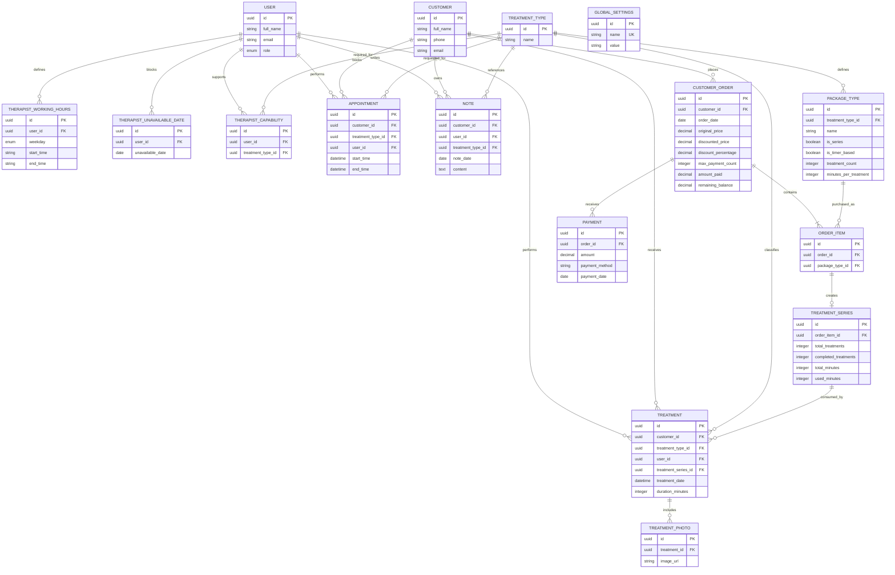

# Database Schema

Database: PostgreSQL. ORM: Entity Framework Core 10. All IDs are UUIDs.

## ER Diagram

## Design Notes

- `User.role` is `Manager` or `Therapist`. No separate Therapist table.
- `TreatmentSeries` is created only for `PackageType.is_series = true` packages.
- `completed_treatments` for timer-based series is derived: `floor(used_minutes / minutes_per_treatment)`. Updated after each timer session.
- `GLOBAL_SETTINGS` is a key-value table. Each setting is a separate row with a unique `name` and a string `value`. Currently defined: `default_max_payment_count`.
