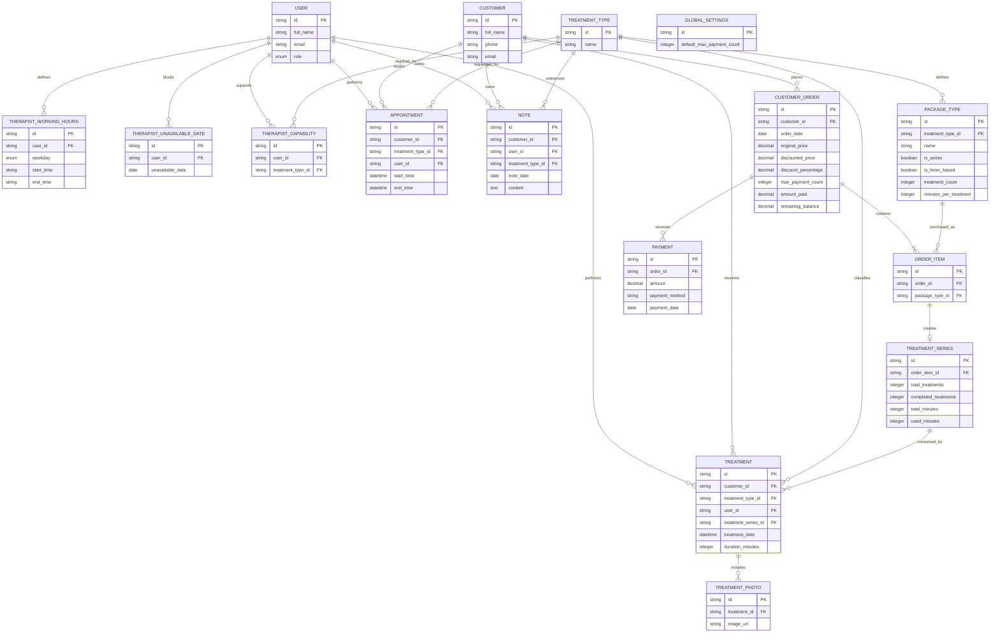

# ERD – Beauty Clinic Management System

## Overview

This ERD models the core business entities for a beauty clinic management system. It focuses on customers, orders, treatment packages, treatment tracking, appointments, therapists (represented as Users with roles), payments, and clinic configuration.

The model is intentionally logical and implementation-agnostic so it can be used as input for code generation tools such as Claude Code.

---

## Mermaid ER Diagram



---

## Main Entities

| Entity                       | Purpose                                                                              |
| ---------------------------- | ------------------------------------------------------------------------------------ |
| **User**                     | System users (Manager / Therapist). Role determines permissions.                     |
| **Customer**                 | Clinic customer profile.                                                             |
| **TreatmentType**            | Defines available treatment categories.                                              |
| **PackageType**              | Defines packages sold by the clinic. Supports quantity-based and timer-based series. |
| **CustomerOrder**            | Customer purchase transaction.                                                       |
| **OrderItem**                | Individual package purchased within an order.                                        |
| **TreatmentSeries**          | Tracks package usage (treatments or minutes consumed).                               |
| **Payment**                  | Payment made toward an order.                                                        |
| **Appointment**              | Scheduled treatment appointment.                                                     |
| **Treatment**                | Actual treatment performed.                                                          |
| **TreatmentPhoto**           | Photos attached to a treatment.                                                      |
| **TherapistWorkingHours**    | Weekly working schedule for therapist users.                                         |
| **TherapistUnavailableDate** | Days a therapist is unavailable.                                                     |
| **TherapistCapability**      | Which treatment types a therapist can perform.                                       |
| **Note**                     | Internal customer notes.                                                             |
| **GlobalSettings**           | Clinic-wide configuration (currently default maximum payment count).                 |

---

## Design Notes

* `User.role` replaces a separate **Therapist** entity.
* Only users whose `role = therapist` participate in appointments, treatments, notes, schedules, and capabilities.
* `TreatmentSeries` is created only for packages marked as **Series**.
* Timer-based packages accumulate usage using `used_minutes`.
* Completed treatments are derived from:

  ```
  floor(used_minutes / minutes_per_treatment)
  ```
* Orders may contain multiple package types.
* Payments belong to a single order.
* Multiple photos may be attached to a treatment.
* Appointment availability is calculated from:

  * Working hours
  * Unavailable dates
  * Existing appointments
  * Therapist capabilities
